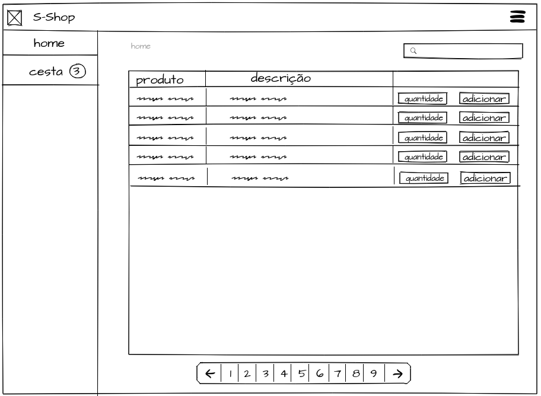
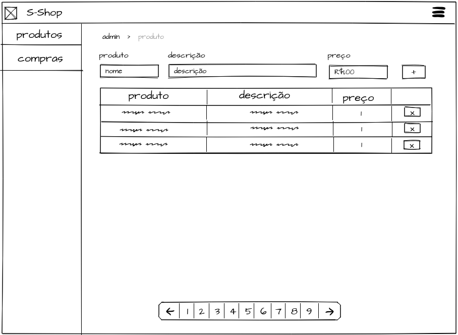
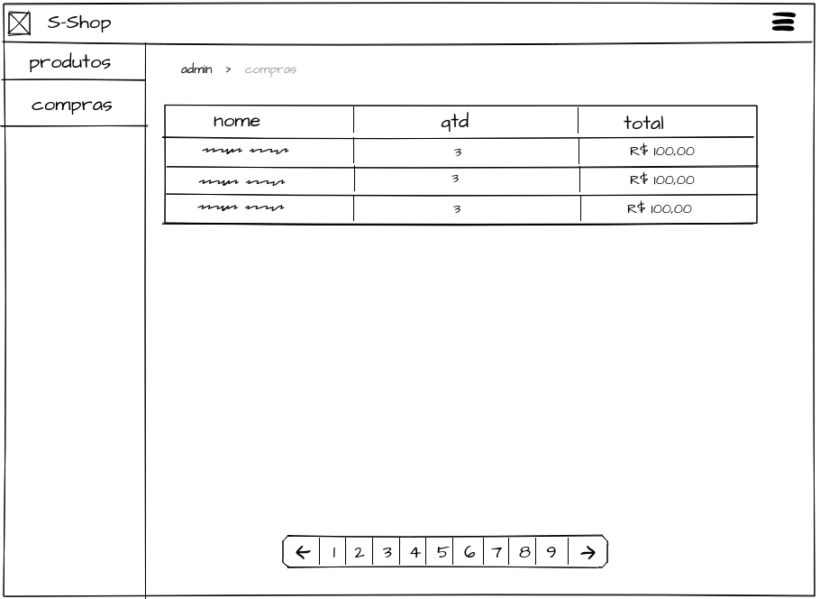

# Desafio front-end/AngularJS Seventh

## Introdução

Esse documento descreve um desafio técnico a ser elaborado pelo candidato à vaga de desenvolvedor front-end (AngularJS) na Seventh Ltda. O desafio consiste em desenvolver um front-end Web para uma API já existente de um sistema do tipo "carrinho de compras". 

## Duração

O desafio foi preparado para exigir do candidato um máximo de 8 horas de trabalho.

## O que será avalidado?

A capacidade do candidato em entregar um software funcional e com qualidade. 

## Overview

O s-shop é um site de compras, que possui uma página administrativa simples para cadastro de produtos
e listagem de compras.

## Desafio

O desafio consiste em criar uma aplicação front-end onde o usuário possa escolher
os produtos e adicionar em uma cesta de compras. A cesta não pode ser limpa ao fazer o reload
da página.

Na página da cesta deve ser obrigatório adicionar um nome para prosseguir com a compra,
o usuário pode remover e mudar a quantidade de itens da cesta.

## Admin

Na seção administrativa devem existir duas páginas:

### A página de produtos

Deve ser possível:
adicionar, alterar e excluir produtos.

### A página de compras

Esta página deve apenas listar as compras.

## Tecnologias

### obrigátorias

- AngularJS +v1.5.x

### Desejáveis

- AngularJS Material versão +1.x.x
- scss para processador de css.

### Opcionais

- Gulp
- Webpack

### Backend

O ponto de entrada da API se encontra em [https://s-shop-test.herokuapp.com/](https://s-shop-test.herokuapp.com/)
e a documentação da API se encontra [aqui](https://s-shop-docs.netlify.com/).

### Entrega

A submissão da proposta deve:
- Ser publicada em um repositório público no GitHub. 
- Conter um readme do projeto indicando instruções para a build e execução do projeto.
- Ter no repositório do Git os commits incrementais da solução;
- O Link para o repositório deve ser enviado para gabrielle.dias@seventh.com.br, acompanhado do CV do candidato. 

